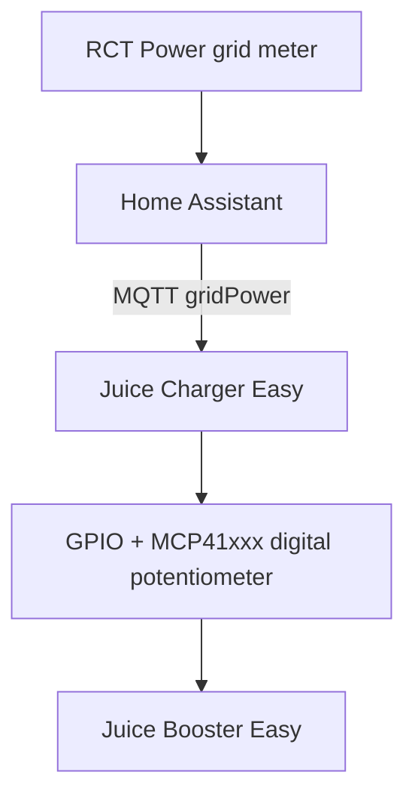

# Juice Charger Easy

Juice Charger Easy is a Raspberry Pi based AC charging controller for the
Juice Booster Easy / Juice CHARGER Easy hardware. It controls the charger
through GPIO and an MCP41xxx digital potentiometer, integrates with MQTT and
Home Assistant, and provides a local web dashboard for commissioning and daily
operation.

The main use case is PV surplus charging: Home Assistant publishes the current
grid import/export power to MQTT, the service calculates the available surplus,
and the Raspberry Pi requests the matching charging current.

Important: the software does not replace the hardware safety concept. The
hardware current selector, RLC reductions, CP vehicle state, and the Juice
Booster Easy control board remain active limits.

## Credits

This repository is a fork of the original
[Andreas1312/charger-easy](https://github.com/Andreas1312/charger-easy)
project by Andreas1312. This fork builds on that work and adds the current
Home Assistant, MQTT, PV surplus, and dashboard commissioning improvements.

## Features

- PV surplus charging from a Home Assistant grid-power MQTT value.
- Instant charging mode with configurable current.
- Pause mode that requests `0 A`.
- Home Assistant MQTT Discovery for controls, sensors, and binary sensors.
- Local web dashboard for mode control, current control, and live diagnostics.
- Hardware current limiting through the original current selector.
- FreeCharge hardware override through DIP1.
- RLC support through DIP2 and four RLC inputs.
- MQTT based integration for Home Assistant, EVCC-style legacy topics, and
  external tools.

## Hardware Requirements

Typical hardware:

- Raspberry Pi with GPIO and SPI.
- MCP41xxx digital potentiometer. MCP4161 is the implementation this project
  was built around.
- Juice Booster Easy / Juice CHARGER Easy control board.
- GPIO wiring between the Raspberry Pi and the charger control board.
- DIP switches for FreeCharge and RLC mode.
- Optional status LEDs and buzzer.

Enable SPI on the Raspberry Pi before running the service:

```bash
sudo raspi-config
```

Choose `Interface Options` -> `SPI` -> `Enable`.

### Wiring Reference

No board-level schematic image is currently included in this repository. The
table below is the software wiring reference used by the service. Pin numbers
are BCM GPIO numbers.

| Function | BCM GPIO | Direction | Pull / active state |
| --- | ---: | --- | --- |
| CP state input A | `6` | input | pull-down |
| CP state input B | `26` | input | pull-down |
| Hardware current selector bit 0 | `18` | input | pull-up |
| Hardware current selector bit 1 | `24` | input | pull-up |
| Hardware current selector bit 2 | `23` | input | pull-up |
| Hardware current selector legacy/reserved pin | `25` | input | pull-up |
| FreeCharge DIP1 | `22` | input | pull-up, `LOW` = ON |
| RLC DIP2 | `27` | input | pull-up, `LOW` = ON |
| RLC1 | `21` | input | pull-down, `HIGH` = active |
| RLC2 | `20` | input | pull-down, `HIGH` = active |
| RLC3 | `16` | input | pull-down, `HIGH` = active |
| RLC4 | `5` | input | pull-down, `HIGH` = active |
| Green LED | `12` | output | EVCC/software mode indicator |
| Blue LED | `19` | output | RLC mode indicator |
| Buzzer | `13` | PWM output | optional |
| SPI CE0 | `8` | SPI | MCP41xxx chip select |
| SPI MOSI | `10` | SPI | MCP41xxx data |
| SPI MISO | `9` | SPI | usually unused by MCP41xxx writes |
| SPI SCLK | `11` | SPI | MCP41xxx clock |

The digital potentiometer is written through SPI bus `0`, device `0`
(`/dev/spidev0.0`). The software maps charging current to the known Juice
Booster current curve:

```text
0 A, 6 A, 8 A, 10 A, 13 A, 16 A, 20 A, 25 A, 32 A
```

The requested current is always limited by the hardware maximum and RLC
percentage before the potentiometer value is written.

## Understanding the Hardware Switches

The DIP switches are active-low. `ON` means the GPIO input reads `LOW`.

### FreeCharge DIP Switch

DIP1 is the physical FreeCharge override.

When DIP1 is ON:

- The hardware FreeCharge override is active.
- Charging can be enabled independently of the selected software mode.
- The charger state JSON reports `hardware_override_free_charge: true`.
- The web dashboard displays a separate `Hardware-FreeCharge aktiv` notice.
- The selected software mode (`off`, `pv`, or `instant`) is still shown.

Important: Hardware FreeCharge does not replace safety limits. The effective
current is still limited by:

1. The hardware current selector.
2. Any active RLC reduction.
3. The CP state and the charger control board.

When DIP1 is OFF, the selected software mode (`off`, `pv`, or `instant`)
decides the requested current.

### RLC DIP Switch

DIP2 enables or disables RLC reductions.

- DIP2 ON: RLC inputs are evaluated.
- DIP2 OFF: RLC inputs are ignored and the RLC limit is `100%`.
- If several RLC inputs are active, the strongest reduction wins.

Default RLC mapping:

| Input | GPIO | Default limit |
| --- | ---: | ---: |
| `rlc1` | `21` | `75%` |
| `rlc2` | `20` | `50%` |
| `rlc3` | `16` | `25%` |
| `rlc4` | `5` | `0%` |

## MQTT Integration

The service connects to the configured MQTT broker and uses
`mqtt.base_topic`, which defaults to `juicebooster`.

For PV surplus charging, Home Assistant must publish grid power to:

```text
juicebooster/ha/gridPower
```

Example payloads:

```text
+1000
```

means the house is importing `1000 W` from the grid.

```text
-2000
```

means the house is exporting `2000 W` to the grid. With the default
`reserve_w: 100`, this is treated as about `1900 W` usable PV surplus before
rounding to charging current.

The default sign convention is:

```yaml
pv:
  grid_power_export_negative: true
```

Use this when your grid meter reports:

- positive values for grid import
- negative values for grid export

If your sensor reports export as positive, set
`grid_power_export_negative: false`.

### MQTT Topics

With the default `base_topic: juicebooster`:

| Topic | Direction | Purpose |
| --- | --- | --- |
| `juicebooster/ha/gridPower` | input | Grid import/export power for PV mode |
| `juicebooster/mode/set` | input | Set selected mode: `off`, `pv`, `instant` |
| `juicebooster/instantCurrent/set` | input | Set instant-mode current in amps |
| `juicebooster/state` | output | Main JSON state for dashboard and Home Assistant |
| `juicebooster/mode` | output | Selected software mode |
| `juicebooster/instantCurrent` | output | Current instant-mode setting |
| `juicebooster/availability` | output | MQTT availability, `online` / `offline` |

Legacy compatibility topics are still published/subscribed:

| Topic | Direction | Purpose |
| --- | --- | --- |
| `juicebooster/enable/set` | input | `true` selects `instant`, `false` selects `off` |
| `juicebooster/maxCurrent/set` | input | Updates instant-mode current |
| `juicebooster/status` | output | Legacy status |
| `juicebooster/enabled` | output | Legacy enabled flag |
| `juicebooster/chargeCurrent` | output | Legacy current value |
| `juicebooster/debug/status` | output | Legacy debug state |

Home Assistant MQTT Discovery is published under:

```text
homeassistant/...
```

unless `home_assistant.discovery_prefix` is changed.

## Home Assistant Setup

Enable the MQTT integration in Home Assistant and connect it to the same MQTT
broker as the Raspberry Pi.

The charger needs the grid power at the grid connection point, not raw inverter
power. For an RCT Power setup, use:

```text
sensor.rct_power_storage_grid_power
```

This sensor represents the actual import/export power after house loads,
battery charging/discharging, and inverter output. Inverter power alone is not
sufficient because it does not tell the charger whether the house is importing
from the grid or exporting surplus.

Add an automation like this:

```yaml
alias: Juice Charger - Publish Grid Power
description: Publish grid import/export power for Juice Charger Easy PV mode.
mode: restart
trigger:
  - platform: state
    entity_id: sensor.rct_power_storage_grid_power
  - platform: time_pattern
    seconds: "/15"
condition:
  - condition: template
    value_template: "{{ is_number(states('sensor.rct_power_storage_grid_power')) }}"
action:
  - action: mqtt.publish
    data:
      topic: "juicebooster/ha/gridPower"
      payload: "{{ states('sensor.rct_power_storage_grid_power') | float }}"
      qos: 0
      retain: false
```

After the service connects, Home Assistant MQTT Discovery creates entities for:

- mode select
- instant-current number control
- CP state
- grid power
- PV surplus
- target current
- effective current
- hardware maximum
- RLC percentage
- limit reason
- vehicle connected
- charging
- hardware FreeCharge override
- stale PV input

Example helper files are included:

- `home_assistant/charger_easy_package.yaml`
- `home_assistant/lovelace-card.yaml`

## Configuration

The default config path is:

```text
/opt/juice-charger/config.yaml
```

You can override it:

```bash
python -m charger_easy.cli --config ./config.yaml
CHARGER_EASY_CONFIG=./config.yaml python -m charger_easy.cli
```

Use the repository `config.yaml` as the template.

### MQTT

| Field | Purpose | Unit / default |
| --- | --- | --- |
| `mqtt.broker_host` | MQTT broker hostname or IP address | default `mqtt.local` |
| `mqtt.broker_port` | MQTT broker TCP port | default `1883` |
| `mqtt.client_id` | MQTT client ID used by the service | default `JuiceBoosterPi` |
| `mqtt.username` | Optional MQTT username | default `null` |
| `mqtt.password` | Optional MQTT password | default `null` |
| `mqtt.base_topic` | Base topic for charger MQTT topics | default `juicebooster` |

Changing `mqtt.base_topic` also changes the default PV input topic to
`<base_topic>/ha/gridPower` unless `pv.grid_power_topic` is set explicitly.

### Logging

| Field | Purpose | Unit / default |
| --- | --- | --- |
| `logging.file_path` | Log file path | default `/opt/juice-charger/charger.log` |
| `logging.level` | Python log level | default `INFO` |

Valid log levels include `DEBUG`, `INFO`, `WARNING`, `ERROR`, and `CRITICAL`.

### RLC Percentages

| Field | Purpose | Unit / default |
| --- | --- | --- |
| `rlc_percentages.rlc1` | Current limit when RLC1 is active | percent, default `75` |
| `rlc_percentages.rlc2` | Current limit when RLC2 is active | percent, default `50` |
| `rlc_percentages.rlc3` | Current limit when RLC3 is active | percent, default `25` |
| `rlc_percentages.rlc4` | Current limit when RLC4 is active | percent, default `0` |

Example: if the hardware selector allows `16 A` and RLC2 is active, the
effective limit is `16 A * 50% = 8 A`.

### LEDs

| Field | Purpose | Unit / default |
| --- | --- | --- |
| `leds.enabled` | Enables green/blue GPIO status LEDs | default config file: `true`; built-in default: `false` |

When enabled:

- green LED = software/EVCC mode active
- blue LED = RLC mode active

### Buzzer

| Field | Purpose | Unit / default |
| --- | --- | --- |
| `buzzer.enabled` | Enables buzzer melodies | default config file: `true`; built-in default: `false` |
| `buzzer.melodies.<name>.sequence` | Melody note list | list of `{f, d}` objects |
| `buzzer.melodies.<name>.sequence[].f` | Frequency | Hz, `0` means silence |
| `buzzer.melodies.<name>.sequence[].d` | Duration | milliseconds |

Known melody names used by the service:

- `startup`
- `car_connected`
- `start_charging`
- `stop_charging`
- `reject`

### Home Assistant

| Field | Purpose | Unit / default |
| --- | --- | --- |
| `home_assistant.discovery` | Enables MQTT Discovery publishing | default `true` |
| `home_assistant.discovery_prefix` | MQTT Discovery prefix | default `homeassistant` |
| `home_assistant.device_id` | Stable Home Assistant device/entity ID prefix | default `juice_charger_easy` |
| `home_assistant.device_name` | Display name in Home Assistant | default `Juice Charger Easy` |

Do not change `device_id` after Home Assistant has discovered the device unless
you intentionally want new entities.

### PV Surplus Charging

| Field | Purpose | Unit / default |
| --- | --- | --- |
| `pv.grid_power_topic` | MQTT topic for grid import/export power | default `<base_topic>/ha/gridPower` |
| `pv.grid_power_export_negative` | Sign convention for grid export | default `true` |
| `pv.voltage` | Voltage used for W-to-A calculation | volts, default `230` |
| `pv.phases` | Number of phases used for charging calculation | `1` to `3`, default `1` |
| `pv.min_current` | Minimum current before PV charging may start | amps, default `6` |
| `pv.current_step` | Current rounding step | amps, default `1` |
| `pv.reserve_w` | Surplus kept unused as a buffer | watts, default `100` |
| `pv.start_delay_seconds` | Stable surplus time before starting from `0 A` | seconds, default `60` |
| `pv.stop_delay_seconds` | Delay before stopping after surplus disappears | seconds, default `180` |
| `pv.input_timeout_seconds` | Maximum age of grid-power MQTT data | seconds, default `60` |

PV surplus is calculated from grid power plus any current charging power, minus
`reserve_w`. With the default sign convention:

```text
pv_surplus_w = -grid_power_w + current_charging_power_w - reserve_w
```

Example when no vehicle is connected:

```text
grid_power_w = -2000 W
reserve_w = 100 W
pv_surplus_w = 1900 W
```

Charging still remains `0 A` until a vehicle is connected.

### Web Dashboard

| Field | Purpose | Unit / default |
| --- | --- | --- |
| `web.enabled` | Starts the local dashboard | default `true` |
| `web.host` | Bind address | default `0.0.0.0` |
| `web.port` | HTTP port | default `8080` |
| `web.title` | Dashboard title | default `Juice Charger Easy` |

Open the dashboard at:

```text
http://<raspberry-pi-ip>:8080/
```

## Installation

Requirements:

- Raspberry Pi OS or another Linux distribution on Raspberry Pi hardware.
- Python `3.10` or newer.
- SPI enabled.
- Network access to the MQTT broker.

Install from a fresh Raspberry Pi shell:

```bash
sudo apt update
sudo apt install -y git python3 python3-venv python3-pip

sudo mkdir -p /opt/juice-charger
sudo chown "$USER":"$USER" /opt/juice-charger

git clone https://github.com/Jastroger/charger-easy.git /opt/juice-charger/app
cd /opt/juice-charger/app

python3 --version
python3 -m venv .venv
. .venv/bin/activate
python -m pip install --upgrade pip
python -m pip install -r requirements.txt

cp config.yaml /opt/juice-charger/config.yaml
nano /opt/juice-charger/config.yaml
```

At minimum, edit:

- `mqtt.broker_host`
- `mqtt.username` and `mqtt.password`, if your broker requires them
- `pv.grid_power_topic`, if you do not use `juicebooster/ha/gridPower`
- `pv.grid_power_export_negative`, if your sign convention differs

Manual foreground start:

```bash
cd /opt/juice-charger/app
. .venv/bin/activate
python -m charger_easy.cli --config /opt/juice-charger/config.yaml
```

The legacy entry point also works:

```bash
python3 mqtt_client.py --config /opt/juice-charger/config.yaml
```

## Systemd Service

Create a service:

```bash
sudo tee /etc/systemd/system/juice-charger-easy.service >/dev/null <<'EOF'
[Unit]
Description=Juice Charger Easy
After=network-online.target
Wants=network-online.target

[Service]
Type=simple
WorkingDirectory=/opt/juice-charger/app
ExecStart=/opt/juice-charger/app/.venv/bin/python -m charger_easy.cli --config /opt/juice-charger/config.yaml
Restart=always
RestartSec=5
User=root
Environment=PYTHONUNBUFFERED=1

[Install]
WantedBy=multi-user.target
EOF
```

Enable automatic startup:

```bash
sudo systemctl daemon-reload
sudo systemctl enable --now juice-charger-easy
sudo systemctl status juice-charger-easy
```

View logs:

```bash
sudo journalctl -u juice-charger-easy -f
```

The service file runs as `root` because GPIO and SPI access on Raspberry Pi
systems is often restricted. If your system grants GPIO/SPI access to a normal
user, you can change `User=root` to that user.

## Verifying Operation

Use this commissioning checklist.

### Step 1: Dashboard Reachable

Open:

```text
http://<raspberry-pi-ip>:8080/
```

Expected:

- The dashboard loads.
- It shows the selected mode.
- It shows CP state, hardware maximum, RLC value, grid power, and PV surplus.

### Step 2: Home Assistant Entities Discovered

In Home Assistant, check the MQTT integration device list.

Expected device:

```text
Juice Charger Easy
```

Expected entities include mode, instant current, grid power, PV surplus, target
current, effective current, limit reason, vehicle connected, charging,
FreeCharge override, and stale PV data.

### Step 3: MQTT Connection Established

Check service logs:

```bash
sudo journalctl -u juice-charger-easy -n 100
```

Expected:

- MQTT connected.
- MQTT topics subscribed.
- Availability published as `online`.

### Step 4: Grid Power Visible

Publish a test value from any MQTT client:

```bash
mosquitto_pub -h <mqtt-host> -t juicebooster/ha/gridPower -m -2000
```

Expected dashboard state:

```text
Grid Power: -2000 W
```

### Step 5: PV Surplus Visible

With default `reserve_w: 100`, the same test value should show:

```text
PV Surplus: 1900 W
```

If PV surplus is missing or always `0`, check the MQTT payload and sign
convention first.

### Step 6: Vehicle Detected

Connect the vehicle.

Expected CP behavior:

- CP state `A`: no vehicle connected
- CP state `B`: vehicle connected
- CP state `C`: charging

The dashboard should show `vehicle_connected: true` for CP state `B` or `C`.

### Step 7: Charging Current Follows Surplus

Select `pv` mode. With a connected vehicle and fresh grid-power data:

- below `pv.min_current`, target current remains `0 A`
- after `pv.start_delay_seconds`, surplus current is requested
- if surplus disappears, `pv.stop_delay_seconds` prevents rapid stop/start
- effective current never exceeds the hardware selector or RLC limit

## Testing Without a Vehicle

PV diagnostics can be tested without a connected vehicle.

When no vehicle is connected:

- Charging current remains `0 A`.
- Target current remains `0 A`.
- PV surplus is still calculated when grid-power MQTT data is available.
- Grid power and PV calculations remain visible in the dashboard and MQTT state.
- The limit reason remains `vehicle_not_connected`.

Example:

```text
gridPower = -2000
reserve_w = 100
```

Expected result:

```text
Grid Power:      -2000 W
PV Surplus:       1900 W
Target Current:      0 A
Effective Current:   0 A
Reason: vehicle_not_connected
```

This is useful during commissioning: it proves that Home Assistant, MQTT, the
grid-power sign convention, and the PV calculation are working before a vehicle
is plugged in.

## Manual Hardware Test

Set a test current directly:

```bash
cd /opt/juice-charger/app
. .venv/bin/activate
sudo .venv/bin/python -m charger_easy.tools.set_current 10
```

Use `--eeprom` only when you intentionally want to write the non-volatile
MCP41xxx fallback register:

```bash
sudo .venv/bin/python -m charger_easy.tools.set_current 10 --eeprom
```

For local dashboard development without Raspberry Pi hardware:

```bash
python -m charger_easy.tools.fake_web
python -m charger_easy.tools.fake_web --mode instant --current 16
python -m charger_easy.tools.fake_web --port 8081
```

## Troubleshooting

| Problem | Likely cause | What to check |
| --- | --- | --- |
| PV data missing | No MQTT messages | Check the Home Assistant automation, MQTT broker, and `juicebooster/ha/gridPower` topic |
| PV surplus always `0` | Wrong sign convention | Publish `-2000`; with `grid_power_export_negative: true`, surplus should become about `1900 W` |
| Dashboard reachable but no Home Assistant entities | MQTT Discovery not working | Check `home_assistant.discovery`, `home_assistant.discovery_prefix`, MQTT retained discovery messages, and HA MQTT integration |
| Vehicle not detected | CP state `A` | Check plug, CP wiring, GPIO6/GPIO26 inputs, and dashboard CP state |
| FreeCharge always active | Hardware DIP switch enabled | Check DIP1 and GPIO22; dashboard should show `Hardware-FreeCharge aktiv` |
| Charging does not start in PV mode | Not enough stable surplus | Check `pv.min_current`, `pv.start_delay_seconds`, `reserve_w`, and PV surplus |
| Charging stops or never rises above a value | Hardware or RLC limit | Check hardware current selector, DIP2, RLC inputs, and `rlc_percentage` |
| PV data becomes stale | MQTT updates stopped or too slow | Check `pv.input_timeout_seconds` and publish at least every 15 to 30 seconds |
| MQTT connects but commands do nothing | Wrong base topic | Check `mqtt.base_topic` and publish to the matching topics |

## FAQ

### Why Is Inverter Power Not Used?

Inverter power only tells you what the inverter is producing. It does not
include house loads, battery charging/discharging, or whether power is actually
being imported from or exported to the grid.

### Why Is Grid Power Used?

Grid power at the connection point is the value that matters for surplus
charging. It shows the net result after PV production, house consumption, and
battery behavior.

For example, `sensor.rct_power_storage_grid_power = -2000` means the house is
exporting `2000 W`. With `reserve_w: 100`, the charger sees `1900 W` usable PV
surplus.

### Why Does Charging Not Start Below 6 A?

AC EV charging has a practical minimum current. The default `pv.min_current` is
`6 A`, matching the usual EVSE minimum. Below that, the charger waits instead of
requesting an unstable or invalid current.

### What Does `reserve_w` Do?

`reserve_w` keeps a buffer so the charger does not consume every watt of
measured export. With `reserve_w: 100` and `gridPower = -2000`, the displayed PV
surplus is `1900 W`.

Increase it if the house tends to briefly import power when loads change.

### What Is FreeCharge?

FreeCharge is the physical DIP1 hardware override. When it is active, the
hardware can permit charging independently of the selected software mode. The
dashboard shows this separately as `Hardware-FreeCharge aktiv`.

FreeCharge still does not bypass the hardware current selector, RLC reductions,
or charger safety behavior.

### What Happens If MQTT Data Becomes Stale?

If no fresh grid-power value arrives within `pv.input_timeout_seconds`, PV mode
requests `0 A` and the state reports:

```text
limit_reason: stale_grid_power
pv_input_stale: true
```

If no vehicle is connected, the effective current is still `0 A` and the limit
reason remains `vehicle_not_connected`, but the dashboard still shows that PV
input is stale.

## Architecture



Plain view:

```text
RCT Power
   ↓
Home Assistant
   ↓ MQTT
Juice Charger Easy
   ↓
GPIO + Digital Potentiometer
   ↓
Juice Booster Easy
```

Runtime flow:

1. Home Assistant publishes grid import/export power to MQTT.
2. Juice Charger Easy reads CP state, DIP switches, hardware maximum, and RLC
   inputs.
3. The selected software mode decides the requested current.
4. Hardware limits and RLC limits cap the request.
5. The Raspberry Pi writes the MCP41xxx potentiometer value.
6. MQTT state and Home Assistant entities are updated.
7. The web dashboard shows selected mode, hardware override, PV data, and the
   current limit reason.

## Disclaimer

This project changes charging behavior and interacts with mains-connected
charging hardware. Use it only if you understand the electrical and hardware
risks. The author assumes no liability for software errors, overloads, damage
to the Juice Booster, house installation, vehicles, Raspberry Pi hardware, or
other equipment. Use at your own risk.

All product and brand names are the property of their respective owners. This
project is not affiliated with Juice Technology AG.
