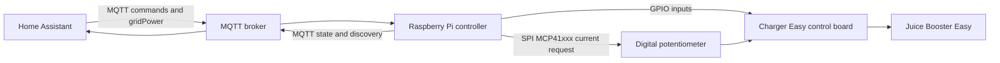

# Architecture

Juice Charger Easy is a local controller that sits between Home Assistant,
MQTT, Raspberry Pi GPIO/SPI, and the Juice Booster Easy / Juice CHARGER Easy
hardware.

It does not replace the charger safety hardware. It requests a current, reads
hardware state, and publishes status.

## High-Level Flow



Plain view:

```text
Home Assistant -> MQTT -> Raspberry Pi Controller -> Charger Easy Hardware
```

## Component Roles

### Raspberry Pi Controller

The Raspberry Pi runs the Python service. It:

- connects to MQTT
- publishes Home Assistant Discovery payloads
- hosts the local web dashboard
- reads GPIO inputs for CP state, DIP switches, current selector, and RLC
- writes the MCP41xxx digital potentiometer over SPI
- calculates PV surplus current in PV mode

### Juice Booster Easy / Charger Easy Hardware

The original charger hardware remains responsible for electrical behavior and
safety boundaries. The software can request a current, but the effective current
is still constrained by:

- hardware current selector
- RLC percentage
- CP vehicle state
- the Charger Easy control board

### MQTT Broker

The MQTT broker is the integration layer. The service subscribes to command
topics and publishes retained state topics.

Default base topic:

```text
juicebooster
```

### Home Assistant

Home Assistant can:

- publish grid power for PV surplus logic
- use MQTT Discovery to create charger entities
- select `off`, `pv`, or `instant`
- control instant current
- display charger state, PV surplus, CP state, and limits

## Operating Modes

### OFF Mode

Software mode: `off`

Behavior:

- requests `0 A`
- resets the PV regulator
- keeps hardware limits active

### INSTANT Mode

Software mode: `instant`

Behavior:

- requests the configured instant current
- instant current is clamped to `0..32 A`
- hardware selector and RLC still cap the effective current

### PV Mode

Software mode: `pv`

Behavior:

- calculates surplus from grid import/export power
- waits for stable surplus before starting
- delays stopping when surplus disappears
- requests `0 A` if grid power is missing or stale

With the default sign convention:

```text
positive grid_power_w = grid import
negative grid_power_w = grid export
```

### Hardware Override / FreeCharge

FreeCharge is a physical hardware override detected through DIP1.

When active:

- the service reports `hardware_override_free_charge: true`
- `effective_mode` becomes `hardware_override_free_charge`
- the selected software mode is still preserved as `mode`
- the dashboard shows a separate hardware override badge
- the requested current is the hardware maximum while a vehicle is connected

Important: FreeCharge is not a safety bypass. Hardware maximum, RLC, CP state,
and charger hardware still apply.

## FreeCharge and Relay Concept

The current code does not expose a separate relay output. It reads the physical
FreeCharge DIP state and uses that as a hardware override signal.

If a specific hardware build includes a relay or additional switching hardware,
document that wiring separately before public release.

TODO: add a real wiring diagram for the tested hardware build.

## PV Surplus Logic

Home Assistant publishes grid power to:

```text
juicebooster/ha/gridPower
```

Default calculation:

```text
pv_surplus_w = -grid_power_w + current_charging_power_w - reserve_w
```

Example:

```text
grid_power_w = -2000 W
reserve_w = 100 W
pv_surplus_w = 1900 W
```

The regulator uses:

- `pv.min_current`
- `pv.current_step`
- `pv.start_delay_seconds`
- `pv.stop_delay_seconds`
- `pv.input_timeout_seconds`

## State Model

The main MQTT state is published to:

```text
juicebooster/state
```

Important fields:

| Field | Meaning |
| --- | --- |
| `mode` | selected software mode |
| `effective_mode` | hardware override if active, otherwise selected mode |
| `cp_state` | Control Pilot state |
| `vehicle_connected` | true for CP state `B` or `C` |
| `is_charging` | true when effective current is above `0 A` and CP state is `C` |
| `hardware_override_free_charge` | physical FreeCharge DIP is active |
| `grid_power_w` | latest grid power input |
| `pv_surplus_w` | calculated PV surplus |
| `target_current_A` | requested software current |
| `effective_current_A` | current after hardware/RLC limits |
| `limit_reason` | active decision or limit reason |
| `pv_input_stale` | grid-power input missing or too old |

## Safety Boundaries

The software can:

- request current through the MCP41xxx digital potentiometer
- stop requesting current
- publish state
- calculate PV surplus

The software cannot:

- validate your mains wiring
- replace physical fuses, RCDs, or EVSE safety behavior
- bypass the hardware maximum selector
- make a wrong GPIO/SPI wiring safe
- guarantee vehicle behavior

Commissioning should always start with software mode `off`, no vehicle
connected, and verified MQTT/PV data.

## Security Boundaries

The software assumes a trusted local network. The web dashboard has no built-in
authentication, and MQTT command topics can change charging behavior.

Keep these interfaces private:

- web dashboard/API
- MQTT broker
- retained MQTT state
- `config.yaml` with broker credentials

Use firewall rules, MQTT ACLs, VPN access, or a reverse proxy with
authentication when the network is shared. See
[Security and Privacy](security-privacy.md).
